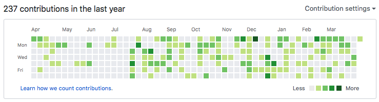
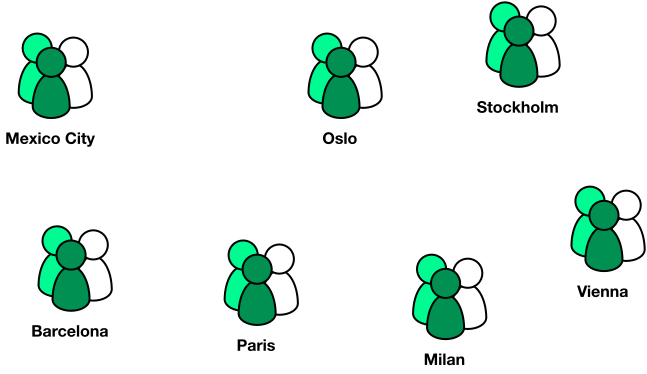
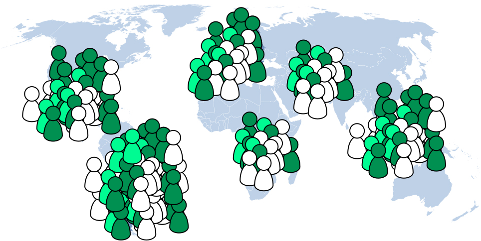
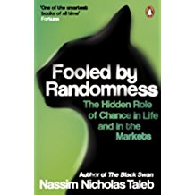
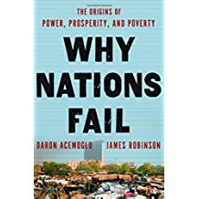
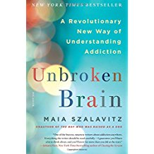
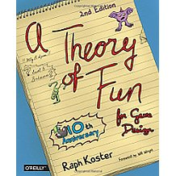

# From zero to your first billion requests
Daniel Giribet   Schibsted Platform Services team

#

## About me

 
{ width=30% }
{ width=20% }
{ width=11% }
{ width=11% }
 

## The context

## Infrastructure and engineering productivity to deliver billions (of low-level requests)
[So our product and development teams can build fantastic stuff on top]{.fragment}

[An effort shared with _all_ engineering teams]{.fragment}

## Challenge \#1 Distributed teams

## Challenge \#2 Lots of users

## Challenge \#3 Mindset

Users -> Engineers

End users -> Customers

Love them both

## Lessons learnt
The most important takeaway first

Building the teams

Growing the teams

Takeaways

## The most important takeaway first

## Build up on the fundamentals {data-background-image="assets/stonehenge.jpg"}
<!-- Ref: https://en.wikipedia.org/wiki/Stonehenge" -->

## Of course this ones
What's the O() cost of whatever?

What's the quickest way to count all 1's in a bit array?

How can a process leave the CPU?

&lt;Insert your fav question here&gt;

## But what about others?
What is the psychological phenomenon of 'anchoring'?

Why do most ecosystems have thriving opportunistic agents?

How do self-replicating ideas propagate?

Are unpredictable rewards more effective?

Do we trust people more if they ask us for help?

## Other fields of knowledge
Economics history

Psychology

Emergent behaviours

Journalism

## Read up on 'other' fundamentals

                                                                                   
<!-- this is my list, but other references should also provide good stuff -->