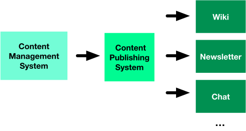

#

## {data-background-image="assets/spread-ideas.jpg"}
<!-- CC https://www.flickr.com/photos/shutterhacks/4474421855/ -->
<h2 style="color: white" >Scalable knowledge</h2>

## Can't train everybody

Can't meet everyone

Can't do joint projects with all teams

<!--
Screencasts rock as they are relatively easy to produce and can be viralised
-->

## Multiple sources of information

<blockquote class="fragment" cite="https://twitter.com/danielgiri/status/983384285020409858">
"All applications evolve to become Content Management Systems or are eventually replaced by ones that do."
</blockquote>

[Wiki-style]{.fragment} [ticket system]{.fragment} [Documents]{.fragment} [Emails]{.fragment} 
[PR discussions]{.fragment} [code issues]{.fragment} [TODOs in the code]{.fragment}
[Email attachments]{.fragment} [Markdown]{.fragment} [YAML]{.fragment}
[ReadTheSource(tm)]{.fragment} [MyCodeDoesn'tNeedComments(tm)]{.fragment} [It's in the production server somewhere]{.fragment}

## Options to scale knowledge
[Digital content industry has been doing this for a while]{.fragment}

[Single data entry as a principle]{.fragment}

[Produce once, publish multiple times]{.fragment}

[It's the video stoopid]{.fragment}

{.fragment}

## Approach of the digital content industry

## It's the video stoopid

Internal concept and training screencasts work surprisingly well

{width=60%}

