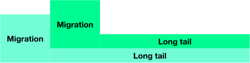
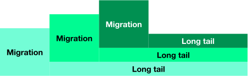
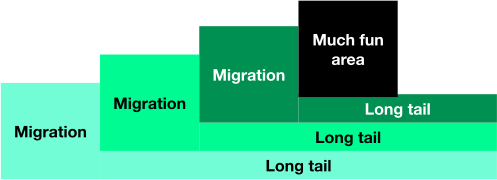
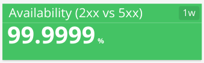
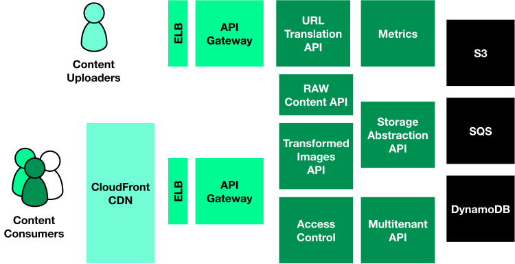
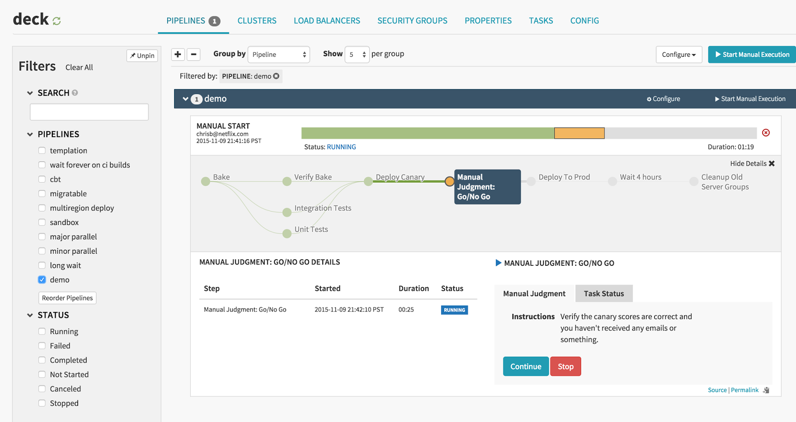

#

## Engineering Mentality {data-background-image="assets/sand-castle.jpg" }

## Engineering Mentality challenges

[Solve operations problems with development solutions]{.fragment}

[Usually the alternative is "we need more people"]{.fragment}

[Or download another (newer) software]{.fragment}

## Download and play
[Download a piece of software]{.fragment}

[Integrate]{.fragment}

[Boom, instant value]{.fragment}

[Move on]{.fragment}

[Extremely successful pattern]{.fragment}

[Emphasizes a specific set of skills]{.fragment}

## Endless migration risk

[Problem - when something does not quite fit or is not implemented]{.fragment}

[Solution is usually...]{.fragment}
[download and play something else]{.fragment}

[We end up spending a significant chunk of our time migrating systems]{.fragment}

## Long tail migration monster 

## And then...

## And guess what...

## All sorts of fun comes next

## Download, play, deep dive
Alternative is to download, play and become a domain expert

[Only in what is core to you]{.fragment}

[Higher risk...]{.fragment} [and reward if done well]{.fragment}

[Challenge - choose core domain and allocate resources]{.fragment}

## Content delivery example

Problem - delivering optimised images and documents to end users

[Solution - Develop and _fine-tune_ a high performance image/document delivery system]{.fragment}

{.fragment}

## Content delivery example

## Cassandra example

Problem - Cassandra backup recovery takes 12h+

[Solution - Develop new backup recovery system - x4 times faster]{.fragment}

## Download, play, contribute
[Even better alternative is to download, play, and contribute code]{.fragment}

[Only on what is even more core for you]{.fragment}

## Spinnaker example

Problem - Spinnaker did not support Travis

{.fragment}

## Developed the support

## Other examples

Cluster management, cluster provisioning, content caching and many others...

## Benefits from Download, play, contribute

[Keep unpracticed skills fresh]{.fragment}

[Who knows, you may get a competitive advantage]{.fragment}

[Become an authoritative source of support]{.fragment}

## Remember managed services

